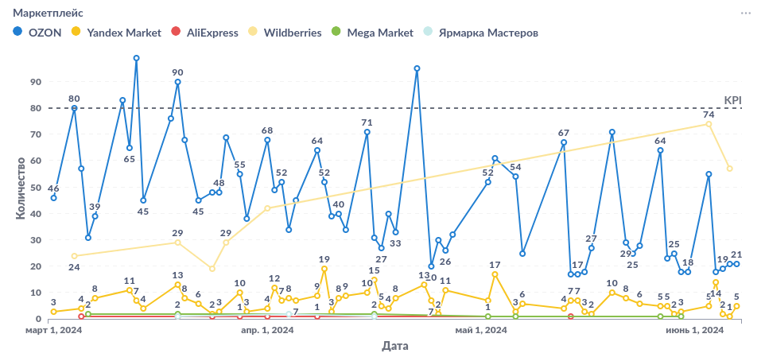
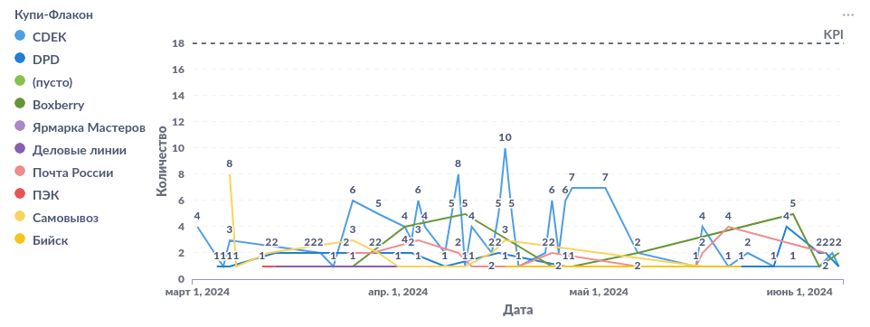

<h3>Купи-Флакон</h3>

Этот проект Kupi-Flakon обладает большим потенциалом для оптимизации процессов и повышения операционной эффективности. Анализ количества собранных заказов позволяет определить пиковое рабочее время и более эффективно распределять ресурсы. Расчет коэффициента эффективности сотрудника помогает выявить слабые места в работе персонала и принять меры по их улучшению.

Анализ показателей среднего количества заказов за определенный период времени позволяет выявить тенденции и изменения спроса на товары. Это помогает оптимизировать запасы и более эффективно управлять производственным процессом. Анализ показателей по дням недели также позволяет оптимизировать график работы и распределение задач между сотрудниками, исходя из пиковой нагрузки в определенные дни.

Внедрение автоматизированных систем учета и анализа данных в проекте Kupi-Flakon значительно упрощает процесс принятия управленческих решений и позволяет оперативно реагировать на изменения рыночных условий. Использование современных технологий аналитики помогает повысить эффективность работы интернет-магазина и улучшить качество обслуживания клиентов.

<h3>Информационная панель</h3>

Данные за 2024

